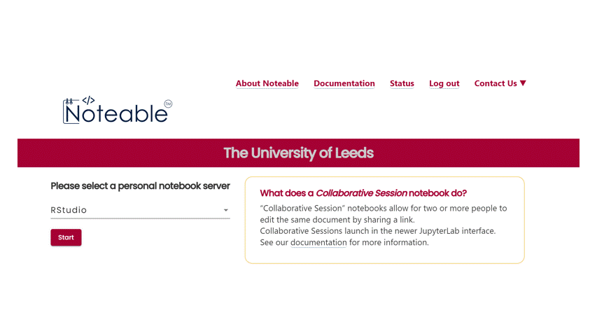

# Noteable

[Noteable](https://noteable.edina.ac.uk/) is a web based server that hosts computational notebooks (workbooks). What this means in practice is that it provides a standard environment where you can develop computational analyses and work with computational data.

## Launch RStudio Server

